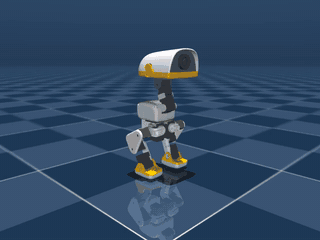
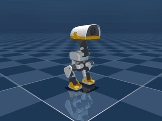
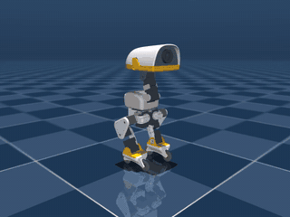
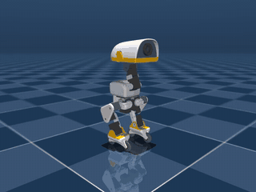

<div align="center">

# 🦆 microdux

**The Pollen Robotics Microduck, trained end-to-end on [JAX](https://github.com/google/jax).**

A port of [`microduck_rl`](https://github.com/pollen-robotics/microduck_rl) from mjlab to [MuJoCo Playground](https://github.com/google-deepmind/mujoco_playground): the BAM actuator, the domain randomisation, the observation delays and the reward set, all inside a single jitted rollout with no host round-trips.

[](LICENSE)
[](https://www.python.org/downloads/)
[](https://github.com/google/jax)

</div>

---

## Why a port and not a wrapper

Almost nothing that makes the duck walk lives in the MJCF. Load the robot into MJX and you get a duck that falls over, because the servo model, the per-episode randomisation, the sensor latency and the reward shaping are all Python in the training stack. `microduck_rl/tasks/mdp.py` alone is 7,188 lines.

So this ports the stack rather than the model file, and keeps the XMLs vendored verbatim so they stay diffable against upstream. Every change MJX needs is applied in code, in `model.py`, where it can be read and tested.

## What is here

- **BAM actuator, m1 through m6.** The firmware voltage law, the DC-motor equation with back-EMF, and the load-dependent Stribeck friction budget, handed to MuJoCo's solver as `dof_frictionloss` so the solver does the static-friction clipping itself. Checked against upstream's own implementation at `rtol=1e-12`.
- **The actuator runs at physics rate.** Upstream calls it inside the decimation loop, so it sees state four times per policy action and rewrites the friction fields each time. `plant.advance` is that loop.
- **Per-episode domain randomisation.** CoM, mass and inertia, rotor inertia, joint friction, foot friction, battery voltage with load sag, encoder bias, IMU mounting error, pushes, and a tilted start.
- **Observation delays.** A ring buffer per term with a per-env lag on a staggered phase: actions lag 3 to 6 control steps, joint velocity a fixed 1 because the Dynamixel firmware reports a moving average.
- **61-dimensional observation** matching upstream's layout exactly, plus a privileged critic observation. The width is the same for every task on purpose: upstream zero-pads the unused command slots so the real robot can swap ONNX policies through one buffer, which is why the ball and the wheels are visible to the critic and not to the policy.
- **All of upstream's tasks**, listed below.
- **Both MJX backends**, with warp the faster of the two on this robot.

## The duck

<div align="center">

| Walk | Turn |
| --- | --- |
|  |  |
| 0.3 m/s commanded, 617M steps | 1.0 rad/s commanded, 1.002 achieved |

| Spin | Swizzle |
| --- | --- |
|  |  |
| pirouette on skates, 206M steps | skating, 34 cm in 8 s, 93M steps |

</div>

Walk and turn come from a finished run. Spin and swizzle are half and a
quarter of the way through theirs, so they are evidence the tasks train
rather than finished policies.

Against the policy `microduck_rl` ships, measured in this simulator on held
commands:

| | this port | upstream |
| --- | --- | --- |
| yaw at +1.0 rad/s | **0.945** | 0.885 |
| yaw at -1.0 rad/s | **-0.915** | -0.851 |
| drift at rest | +0.006 | -0.007 |
| forward at 0.2 m/s | 0.096 | 0.106 |

Turning is symmetric and a little sharper than upstream's. Forward tracking is
slightly short of it. One training seed each, so read the large gaps and
ignore the small ones.

## Tasks

| Task | Class | Model | Trained |
| --- | --- | --- | --- |
| Flat velocity | `Velocity` | `walk` | yes, reproduces upstream |
| Rough terrain | `Velocity(terrain=...)` | `walk` | no |
| Velocity and stand | `VelStand` | `walk` | no |
| Stand up | `StandUp` | `allcollisions` | no |
| Sit to stand | `SitStand` | `allcollisions` | no |
| Roller velocity | `Rollers` | `rollers` | in progress |
| Spin | `Spin` | `rollers` | in progress |
| Swizzle | `Swizzle` | `rollers` | in progress |
| Roller crouch | `RollerCrouch` | `rollers` | no |
| Roller stand up | `RollerStandUp` | `rollers` | no |
| Roller slope | `RollerSlope` | `rollers` | no |
| Roulade | `Roulade` | `allcollisions` | no |
| Ball kick | `BallKick` | `allcollisions` | in progress |
| Ground pick | `GroundPick` | `allcollisions` | no |

Every one of them builds, resets and steps with finite observations and rewards. Only the flat velocity task has been trained to a policy that reproduces upstream's numbers, so treat the rest as ported rather than proven.

```bash
python -m microdux.run --task spin --impl warp --num-envs 4096
```

They also register with MuJoCo Playground, so Playground's own tooling loads
them without knowing anything about this package:

```python
from mujoco_playground import registry
import microdux.registry

microdux.registry.register()

env = registry.load("MicroduckSpin", config_overrides={"weights.upright": 3.0})
```

`registry.get_default_config` returns a `ConfigDict` built from the task's own
dataclasses, so every weight and tuning constant is reachable by dotted name.

## Backends

`impl` reaches `mjx.put_model`, and both backends work:

| | control steps/s at 4096 envs |
| --- | --- |
| `warp` | 28,420 |
| `jax` | 12,136 |

Three runs each on an idle A100, ±2%. The gap widens as the batch shrinks, because warp saturates while MJX scales close to linearly: at 1024 envs it is 4.95x rather than 2.34x.

Warp needs its contact arrays sized for the whole batch rather than one world. `mjx.make_data` is called once outside the vmap with `naconmax` scaled by the env count. Calling it inside a vmapped `reset`, which is how a Playground env is normally written, gives every world a single-world contact buffer, and the run dies with an illegal memory access the moment enough feet touch the floor.

## Install

```bash
uv sync
uv run pytest -q
```

## Use

```python
from microdux import Velocity, randomize, delay

env = Velocity(spec=randomize.Spec(), noise=delay.Noise())
```

It is a MuJoCo Playground `MjxEnv`, so anything that consumes Playground consumes this.

```python
from microdux.train import learn

make_policy, params, history = learn(timesteps=30_000_000, num_envs=2048)
```

```python
from microdux import render

qpos, rewards, dones = render.rollout(env, steps=500)
render.film(env, qpos, "duck.mp4")
```

## Model variants

| Variant | Model | Notes |
| --- | --- | --- |
| `walk` | `robot_walk.xml` | Feet only, the velocity task |
| `allcollisions` | `robot_allcollisions.xml` | Full collision set, standup and ground pick |
| `rollers` | `robot_allcollisions_rollers.xml` | Roller skates, passive wheel hinges |
| `walk_backlash` | `robot_walk_backlash.xml` | ±1° play in series with each servo |
| `backlash` | `robot_allcollisions_backlash.xml` | Full collisions plus backlash |
| `rollers_backlash` | `robot_allcollisions_rollers_backlash.xml` | Rollers plus backlash |

## Testing

Risky machinery is checked against upstream rather than against a reading of upstream. Golden fixtures are generated by calling `bam`'s own `compute_control`, `compute_torque` and `_compute_friction_budget` in an environment with mjlab installed, then frozen.

```bash
uv run pytest -q
```

## Status

All fourteen tasks are ported and run on both backends. The flat velocity task is the only one trained to upstream's numbers: turning is a little sharper than the policy `microduck_rl` ships (yaw **+0.945 / −0.915** against **+0.885 / −0.851**), forward tracking a little short of it (0.096 against 0.106), on one training seed each, so read the large gaps and ignore the small ones.

Known gaps, in the order they will bite:

- **Curricula that move the start distribution do not run.** `reset` cannot see the training step, because the auto-reset wrapper restores the counter after `reset` returns. `wrappers.AutoReset` has the hook that fixes this and no task implements it yet, so `StandUp`, `SitStand`, `RollerStandUp` and `Roulade` sit at upstream's step-0 spawn mix for the whole run. See `docs/reset-curricula.md`.
- **Hyperparameters are the walking task's**, unchanged, where upstream tunes per task.
- **Two tasks lose a per-env randomisation** to the shared heightfield: roller slope ramp lengths are fixed per curriculum level rather than drawn per env.
- **ONNX export for the real robot** exists in `tools/export_onnx.py` and has not been run against hardware.

The game the duck plays against another duck is not here. This package is upstream's single-robot tasks plus the machinery to build your own; the two-seat soccer task built on top of it lives in relax, which already carries the multi-agent training.

## Credits

The robot MJCF and meshes come from [`pollen-robotics/microduck_rl`](https://github.com/pollen-robotics/microduck_rl), the actuator model from Rhoban's [`bam`](https://github.com/Rhoban/bam), and the task structure from [`mjlab`](https://github.com/mujocolab/mjlab).
